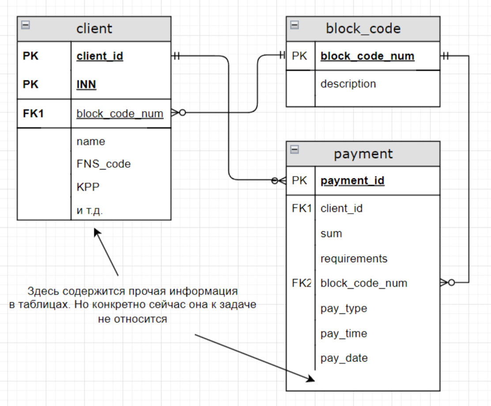

## Логическая схема БД

### Таблица клиентов (clients)
В данном отношении хранятся данные о клиентах и их текущий статус блокировки (block_code_num)
#### Атрибуты отношения:
-	client_id - уникальный идентификатор (int4)
-	name - название организации (varchar 100)
-	INN - уникальный ИНН юридического лица, часть составного ключа отношения (varchar 10)
-	KPP - КПП юридического лица(varchar 9)
-	block_code_num - код, отображающий текущий статус блокировки платежей клиента (int2) (для выяснения конкретной причины придется джойнить таблицы клиентов и кодов, но без этого никак, иначе отношения не нормализованы)

### Таблица кодов блокировки (block_code)
#### Атрибуты отношения:
-	block_code_num - уникальный номер кода, выступает в качестве ID (int2)
-	description - описание конкретного кода, содержит описание причины блокировки (varchar 500)
#### Виды кодов состояния
- 0 - не заблокирован
-	1%% - коды, относящиеся к блокировке платежей добропорядочных клиентов (в связи с неверными реквизитами). Здесь 100 - базовый общий код, остальные - конкретизирующие детали блокировок.
-	2%% - коды, относящиеся к блокировке платежей в связи с подозрением в мошенничестве. Здесь 200 - базовый общий код, остальные - конкретизирующие детали блокировок.

### Таблица платежей (payment)
Для отслеживания истории платежей клиентов, а также информации о самих платежах: реквизитах, времени и т.п.
#### Атрибуты отношения:
-	payment_id - идентификатор платежа (int4)
-	requirements - реквизиты платежа (varchar 35)
-	client_id - идентификатор клиента, куда направлен платеж (int4)
-	block_code_num - код статуса платежа (блокирован или нет) (int2)

